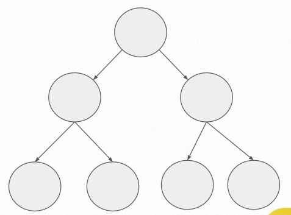
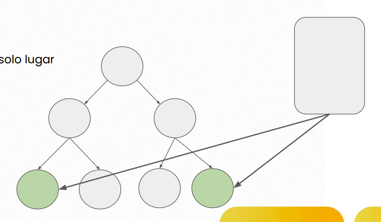

# Historia de Redux:

Tenemos un arbol simulando los nodos de un html:

Tenemos un nodo padre y luego otros componentes hijos, un arbol binario, el arbol de una app crece hacia abajo desde un padre.

Antes de redux nosotro teniamos que manejar la información dentro de cada uno de los componentes. Osea dentro de cada nodo. La informacion vivia en ese nodo y podia pasar esa información a los nodos descendientes.

Pero que pasa si un descendiente tiene una informacion y debe pasarla a un padre, eso no se puede hacer y tampoco podemos cargar un nodo padre con toda la información porque se hace poco eficiente.

Al igual sucede si un componente hermano necesita la misma información que tiene un nodo. No podemos pasar la informacion, esta solo viaja de un padre a un hijo por medio de props pero nunca de un hijo a un padre y menos a un hermano.

Gracias a redux podemos crear un espacio, un lugar donde meteremos esa información y luego cada nodo podria acceder a esa información cuando la necesite, un solo lugar, una sola fuente de información. La store, que es un megaobjeto. Esto es lo que llamamos un manejador de estado.

Un manejador de estado es muy importante a dia de hoy en los proyectos pero no siempre vamos a necesitar un manejador de estado.
