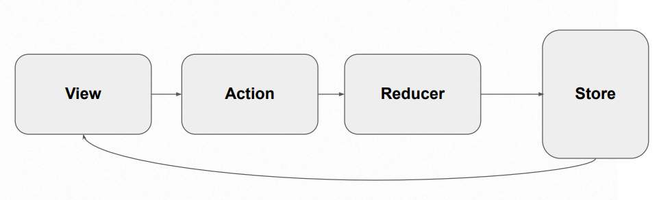

# Redux:

Tenemos un flujo unidireccional. De como viaja la información desde los componentes hasta la store.

Es el camino que debe seguir la informacion hasta la store.

- View:

Esto es la vista, los componentes. Es un componente que necesita informacion. La vista llama a la accion.

- Action:

Las acciones son metodos que hacen algo, que envian informacion por medio de objetos o métodos con una clave para que el reducer que esta escuchando y va y actualiza la store. La accion se encarga de traer informacion, llamar a la BD, hacer trabajo asincrono.

- Reducer:

Son funciones que actualizan la store, nunca la vista actualiza la store, eso lo hace el reducer.

- Store: Es donde vive la información.

Ventajas de usar Redux:

- Una sola fuente de la verdad,

- La información puede ser accesada desde cualquier componente.

- Persistencia de estado.

- Debuggear es muy sencillo.

- Fácil de testear.
